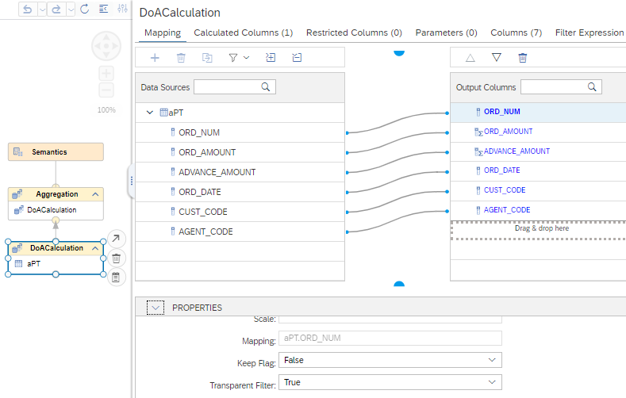
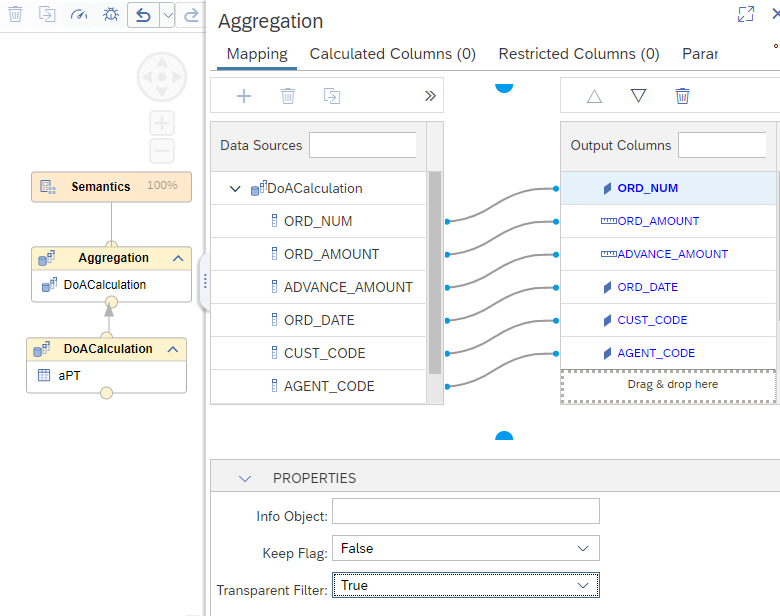

# [Automatic propagation of Transparent Filter setting](https://help.sap.com/docs/hana-cloud-database/sap-hana-cloud-sap-hana-database-modeling-guide-for-sap-business-application-studio/use-transparent-filter?)

The column property [Transparent Filter](https://help.sap.com/docs/hana-cloud-database/sap-hana-cloud-sap-hana-database-modeling-guide-for-sap-business-application-studio/use-transparent-filter) removes columns from aggregations when the columns are only used for filtering data but not requested on their own. The property has to be set for the column continuously from the node after which removal should start up to the node Semantics.

With the new functionality, if you set the property Transparent Filter in a node of a calculation view, the property is automatically propagated up to the Semantics node.

## Example
Compare the results of a calculated column when a filter column is used with the setting Transparent Filter to the results when the filter column is defined without the Transparent Filter setting: Even though the filter does not exclude any records, the values of the calculated column change depending on whether the filter column is removed (Transparent Filter setting) or not (no Transparent Filter setting) before its calculation.

The following shows the impact of a filter when no transparent filter flag is used:

```SQL
SELECT
    CUST_CODE,
    AVG("PercentagePaid")
FROM 
    "aPT_cv"
WHERE          -- difference is here
    ORD_NUM> 0 -- and here
GROUP 
    BY CUST_CODE

MINUS

SELECT
    CUST_CODE,
    AVG("PercentagePaid")
FROM 
    "aPT_cv"
GROUP 
    BY CUST_CODE
```

returns without transparent filter:

**CUST\_CODE**|**AVG(PercentagePaid)**
:-----:|:-----:
D19107|0.17
D19108|0.21
D19122|0.16
D19109|0.38
D19115|0.28
D19112|0.18

Showing a difference in results whether or not a filter is defined on a column or not even though the filter does not exclude any rows.

When the Transparent Filter property of column ORD_NUM is set to True, the same query returns an empty result. The empty result shows that the results do not differ anymore between using a filter or not.

## Propagation of Transparent Filter setting

> In this example, the Transparent Filter has to be turned on beginning in node "DoACalculation".

When setting the Transparent Filter in DoACalculation to True :



the Transparent Filter setting is now automatically propagated up to the Node Semantics:



Similarly, if a Transparent Filter setting is changed to False, this change is propagated downwards in the model