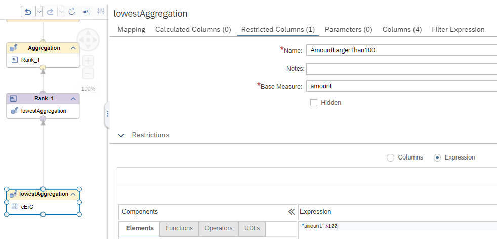
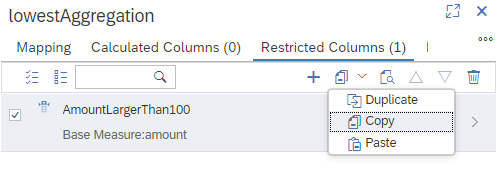
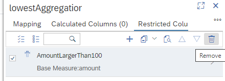
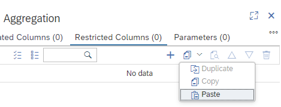

# [Copying Elements Within Calculation Views](https://help.sap.com/docs/hana-cloud-database/sap-hana-cloud-sap-hana-database-modeling-guide-for-sap-business-application-studio/copying-calculation-view-elements?)

Copying and pasting restricted columns is now enabled within calculation views.

## Example

In example [calculation view with restricted measure](./cErC_cv.hdbcalculationview) a restriction is defined on a measure in the lowest aggregation node:



Due to this definition individual records with amounts smaller or equal to 100 are not included in restricted column AmountLargerThan100.

Running SQL Query

```SQL
SELECT 
	"country",
	SUM("amount") AS "amount",
	SUM("AmountLargerThan100") AS "AmountLargerThan100"
FROM "cErC_cv"
GROUP BY "country"
ORDER BY "country"
```

returns

**country**|**amount**|**AmountLargerThan100**
:-----:|:-----:|:-----:
CN|140.00|**NULL**
DE|291.00|101.00
US|30.00|**NULL**

If the restricted column is moved after the first aggregation, the records with e.g., value "DE" in column "country" will be aggregated before the amount is evaluated. This can change the results due to the changed semantic of the model.

## Innovation
You can now more easily move the definition of restricted columns and thus reflect your intention. To move the restricted column to the aggregation node on top:

1. Select the restricted column and choose Copy from the drop-down:

    

2. Choose Remove to delete the restricted column in the current node:

    

3. Under tab Restricted Columns of the target node select Paste from the drop-down menu:

    

After deployment, re-running the query from above includes in restricted measure "AmountLargerThan100" a record if the record belongs to a "country" whose Amount is larger than 100 after aggregation:

**country**|**amount**|**AmountLargerThan100**
:-----:|:-----:|:-----:
CN|140.00|**140.00**
DE|291.00|**291.00**
US|30.00|**NULL**

> Only aggregation nodes can serve as target nodes for restricted columns
