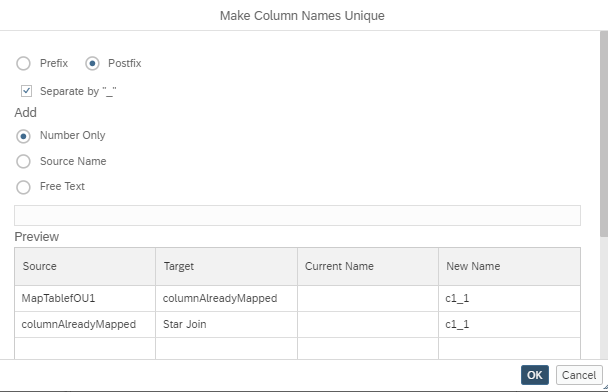

# Choose How To Make Columns Unique During Propagate To Semantics

It is now possible to choose in which way naming conflicts are resolved that arise when [columns  are propagated](https://help.sap.com/docs/hana-cloud-database/sap-hana-cloud-sap-hana-database-modeling-guide-for-sap-business-application-studio/propagate-columns-to-semantics?) to the Semantics node. In example [optionsToMakeColumnsUniqueDuringPropagation](./optionsToMakeColumnsUniqueDuringPropagation.hdbcalculationview) column c_1 of node MapTablefOU1 cannot be propagated to the semantics without a collision because column c_1 is already mapped in node columnAlreadyMapped. To solve this collision the Make Columns Unique dialog is invoked.

A similar dialog is started if a naming conflict arises during mapping of columns or adding a dimension view into a star-join 
 
Options to make the column names unique include adding:

- numbers
- data source name
- static text

to the column name.

The chosen conflict resolution option can be applied as pre-fix or post-fix.

Per default and if other selected resolve-options lead to further conflicts numbers are added.

>Propagate to Semantics can also be used to propagate a renaming of a column to the Semantics. This is done by changing the name of an already mapped column and starting the Propagate to Semantics functionality. In this situation the Make Columns Unique dialog is not invoked and in case of name collisions, propagation is canceled instead.
