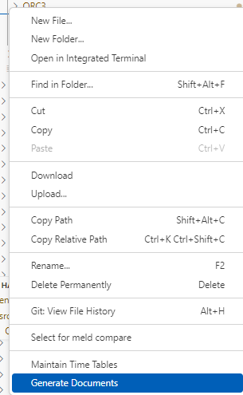
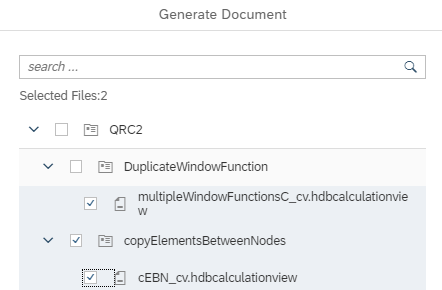

# [Generate Documents on Folder Level](https://help.sap.com/docs/hana-cloud-database/sap-hana-cloud-sap-hana-database-modeling-guide-for-sap-business-application-studio/generate-calculation-view-document?)

The option to generate documents that contain descriptions of calculation views can now be applied on folder level:

Individual selections of calculation views are also possible:

The resulting documents are generated into a dedicated folder "doc" which is a subfolder of the db module folder.

To view the documentation, download the respective files and open them locally in your browser.

