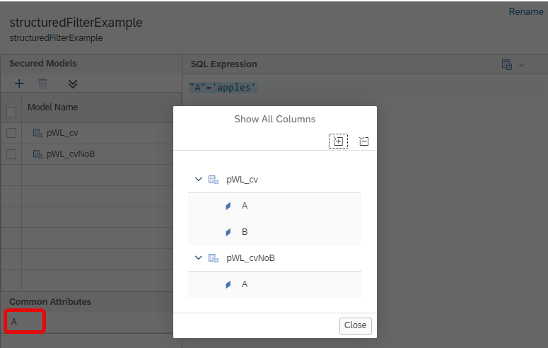

# [Graphical Support of Creating Structured Filters](https://help.sap.com/docs/hana-cloud-database/sap-hana-cloud-sap-hana-database-modeling-guide-for-sap-business-application-studio/create-analytic-privileges?)

A graphical editor for developing [structured filters](https://help.sap.com/docs/hana-cloud-database/sap-hana-cloud-sap-hana-database-sql-reference-guide/create-structured-filter-statement-data-definition) is now available.

Per default the editor is launched when clicking on a file with extension ".hdbstructuredfilter":

Attributes that exist in all Secured Models and thus can be used to secure all models are listed under Common Attributes.

