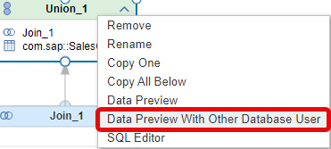
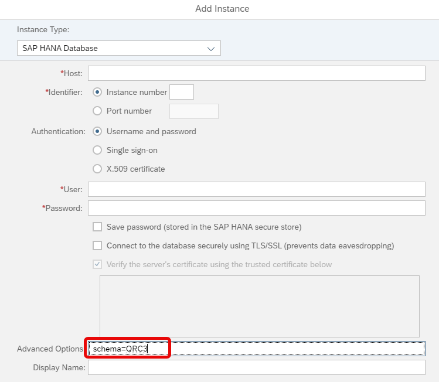

# [Data Preview on Intermediate Nodes Without Privileges to Deploy](https://help.sap.com/docs/hana-cloud-database/sap-hana-cloud-sap-hana-database-modeling-guide-for-sap-business-application-studio/preview-calculation-view-output?)

For security reasons data preview of intermediate nodes in productive systems should be run without deployment privileges. This can be achieved by using a dedicated user-provided service as detailed in this [blog](https://community.sap.com/t5/technology-blogs-by-sap/intermediate-data-previews-on-calculation-views-without-permissions-to/ba-p/13524247).

An alternative option is to configure a database connection and to use this database connection during "Data Preview With Other Database User":



## Prerequisites

- the calculation view that is opened in BAS must have the same name and the same node names as the target calculation view that should be previewed
- a database connection is defined in Database Explorer with a database user of the target database
- the database user in the target database has privilege SELECT on the target calculation view and privilege EXECUTE for the procedure \<target container schema\>#DI.CREATE_INTERMEDIATE_CALCULATION_VIEW 


## Steps

1. Right-click on the node for which a data preview should be executed and choose "Data Preview With Other Database User"
2. Choose the database connection with the user in the target database
3. Confirm or change the target schema

    >If you want a specific database schema for a database connection per default use the Advanced Option setting when creating the database connection in Database Explorer. The following screenshot shows an example how the schema is changed to "QRC3":
        


## Appendix

To grant privilege EXECUTE on \<target container schema\>#DI.CREATE_INTERMEDIATE_CALCULATION_VIEW use a database user that is container group admin of container group BROKER_CG.

The following statements make database user DBADMIN container group admin of container group BROKER_CG. Run these statements with database user DBADMIN:

#### make DBADMIN container group admin of container group BROKER_CG

```SQL
CREATE LOCAL TEMPORARY COLUMN TABLE #PRIVILEGES LIKE _SYS_DI.TT_API_PRIVILEGES;

INSERT INTO #PRIVILEGES (PRINCIPAL_NAME, PRIVILEGE_NAME, OBJECT_NAME) SELECT 'DBADMIN', PRIVILEGE_NAME, OBJECT_NAME FROM _SYS_DI.T_DEFAULT_CONTAINER_GROUP_ADMIN_PRIVILEGES;

CALL _SYS_DI.GRANT_CONTAINER_GROUP_API_PRIVILEGES('BROKER_CG', #PRIVILEGES, _SYS_DI.T_NO_PARAMETERS, ?, ?, ?);

DROP TABLE #PRIVILEGES;
```

Use the container group admin of container group BROKER_CG (DBADMIN in the example) to execute the following statements which grant EXECUTE privileges on the procedure to database user \<intermediate data preview user\>:

#### grant EXECUTE privileges

>Don't forget to replace 
>- \<intermediate data preview user\> with the database user 
>- \<target schema\> with the target schema 
>
>of the target database


```SQL
CREATE LOCAL TEMPORARY COLUMN TABLE #PRIVILEGES LIKE _SYS_DI.TT_API_PRIVILEGES;

INSERT INTO #PRIVILEGES (PRINCIPAL_NAME, PRIVILEGE_NAME, OBJECT_NAME) VALUES ('<intermediate data preview user>', 'EXECUTE', 'CREATE_INTERMEDIATE_CALCULATION_VIEW');

CALL _SYS_DI#BROKER_CG.GRANT_CONTAINER_API_PRIVILEGES('<target schema>', #PRIVILEGES, _SYS_DI.T_NO_PARAMETERS, ?, ?, ?);

DROP TABLE #PRIVILEGES;
```


### Limitations

This functionality is not available when [connecting with Business Application Studio to a HANA on premise database](https://help.sap.com/docs/SAP_HANA_PLATFORM/cf8b4c5847374960a68b55cb86eae013/ebd3400f602c4d18bfc984b9af563781.html)
