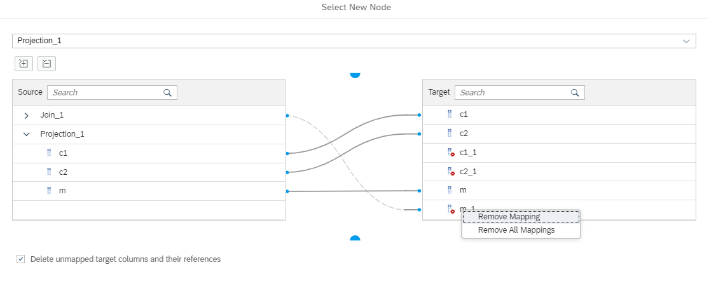

# [Remove a Node Without Loosing the Mapping](https://help.sap.com/docs/hana-cloud-database/sap-hana-cloud-sap-hana-database-modeling-guide-for-sap-business-application-studio/connect-adjoining-nodes-during-node-removal)

During removal of a node a dialog is started that offers to directly map the incoming to the outgoing columns so that the mappings can be preserved.

For example, when deleting node Join_1 in [rNWBF_cv](rNWBF_cv.hdbcalculationview):

a dialog is launched that helps to map the columns and to reuse the existing mapping information:

Afterwards two adjoining nodes are connected using the mapping specification of the dialog:

### Limitation
Not available for multiple consumer nodes where the to-be-deleted node feeds into more than one node:

