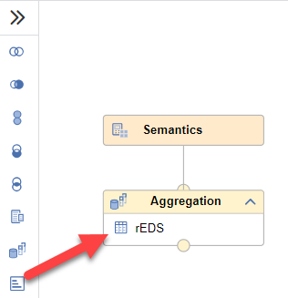
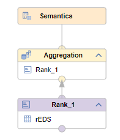

# [Replace Existing Data Source with New Node](https://help.sap.com/docs/hana-cloud-database/sap-hana-cloud-sap-hana-database-modeling-guide-for-sap-business-application-studio/enrich-data-flow-with-additional-nodes?)

To enhance a data source by a new node, drop the new node to the existing data source.

## Example

The data source of the Aggregation node should be first processed by a Rank node:

 To achieve this, select a Rank node and place it on the data source. This enhances the data flow with a Rank node:

 