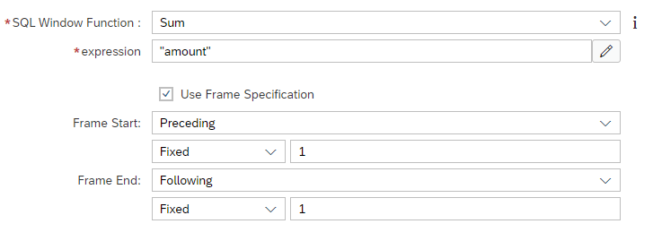
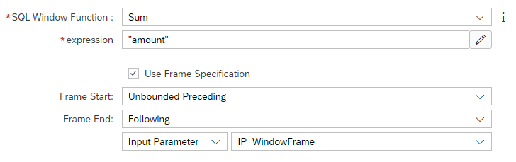

# [Frames in Window Functions](https://help.sap.com/docs/hana-cloud-database/sap-hana-cloud-sap-hana-database-modeling-guide-for-sap-business-application-studio/create-window-function-nodes?)

Frames define within window functions the context for each row. With frames it is possible to evaluate a row in the context of proceeding and following rows.

> Frames make the Order Column mandatory irrespective of the used window function 

For each row the field Frame Start defines which is the first row that should be included when  determining the value of the current row. Analogously, the field Frame End defines which is the last row that should be taken into account.

## Examples

### Fixed Preceding and Following

Setting Frame Start to Preceding 1 and Frame End to Following 1, each row is evaluated in the context of its immediately preceding and following row:



```SQL
SELECT 
	"date",
	"product",
	"amount",
	"c_sum"
FROM 
	"windowFunctionWithFrame_PrecedingFollowing1"
```

**date**|**product**|**amount**|**c\_sum**
:-----:|:-----:|:-----:|:-----:
2023-01-01|banana|1.00|3
2023-01-02|banana|*2.00*|6
2023-01-03|banana|*3.00*|**9**
2023-01-04|banana|*4.00*|12
2023-01-05|banana|5.00|15
2023-01-06|banana|6.00|18
2023-01-07|banana|7.00|21
2023-01-08|banana|8.00|24
2023-01-09|banana|9.00|17
2023-01-01|apple|1.00|3
2023-01-02|apple|2.00|6

Each c_sum value is the sum of its own value and its two surrounding rows. For example, the bold number 9 is derived by the 3 italic values 2, 3, 4

### Preceding unbound, following limited by input parameter

In this example, all values within the partition up to the to be evaluated row are summed up together with the following rows that are bound by an input parameter:




```SQL
SELECT 
	"date",
	"product",
	"amount",
	"c_sum"
FROM 
	"windowFunctionWithFrame_unboundedFollowingWithIP"
    (placeholder."$$IP_WindowFrame$$"=>2)
```


**date**|**product**|**amount**|**c\_sum**
:-----:|:-----:|:-----:|:-----:
2023-01-01|banana|*1.00*|6
2023-01-02|banana|*2.00*|10
2023-01-03|banana|*3.00*|15
2023-01-04|banana|*4.00*|21
2023-01-05|banana|*5.00*|**28**
2023-01-06|banana|*6.00*|36
2023-01-07|banana|*7.00*|45
2023-01-08|banana|8.00|45
2023-01-09|banana|9.00|45
2023-01-01|apple|1.00|6
2023-01-02|apple|2.00|10


Each row sums up all preceding values of its partition together with, based on the input parameter value, 2 following rows. The bold c_sum value 28 for example, is the sum of all italic values: all preceding values, the current row and two following values.