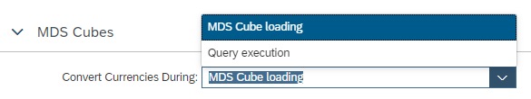

# Select time of currency conversion for MDS Cubes

Currency measures that are included in MDS Cubes can be converted at the time the MDS Cube is loaded, or the time when the query on the MDS Cube is executed.

a) If conversion happens at MDS Cube loading time (default setting) the result of the conversion is persisted and cannot be changed afterwards, e.g., by selecting a different target currency at query execution time.

b) If conversion happens at Query execution time the conversion can be influenced by input parameter prompts for example for the target currency. This additional flexibility can lead to slightly longer query execution times due to the additional currency conversion at query execution time.

The time of conversion is [set globally](https://help.sap.com/docs/hana-cloud-database/sap-hana-cloud-sap-hana-database-modeling-guide-for-sap-business-application-studio/quick-reference-calculation-view-properties) for a calculation view under 

*View Properties*, tab: *General*, section: *MDS Cubes*

