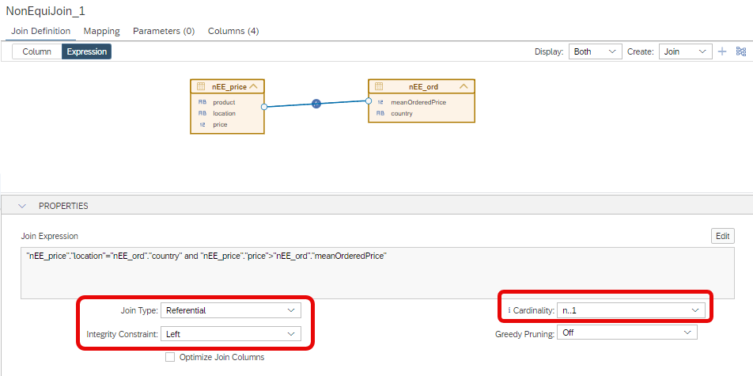
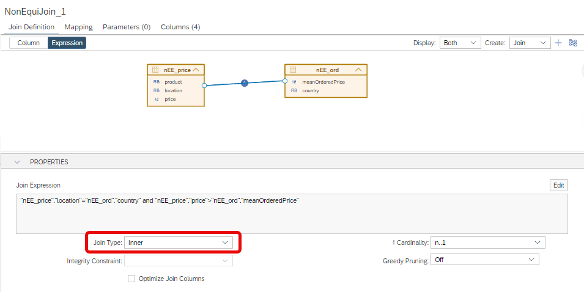
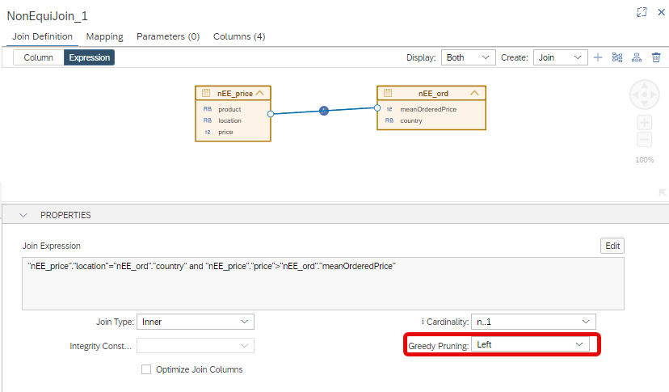

# Additional performance options for Non Equi Joins

### Referential Join
The type *Referential Join* can be selected for non equi joins. When modeling a referential join, the modeler guarantees that an entry on the side on which the [integrity constraint](https://help.sap.com/docs/hana-cloud-database/sap-hana-cloud-sap-hana-database-modeling-guide-for-sap-business-application-studio/supported-join-types) is placed is always matched with at least one entry on the other side.

### Greedy Pruning
Option [Greedy Pruning](https://help.sap.com/docs/hana-cloud-database/sap-hana-cloud-sap-hana-database-performance-guide-for-developers/greedy-join-pruning) is now also available for non equi joins.

> Both options can help to speed up query processing but require a detailed understanding of the pre-requisites

### Example Referential Join

- Deploy [nEE_cv](./nEE_cv.hdbcalculationview) with Join Type Referential, Integrity Constraint Left, and cardinality n..1:

    

- Execute Explain Plan for a query that requests columns only from the left side of the join:

    ```SQL
    SELECT 
	    "product",
	    "location", 
	    SUM("price") AS "price"
    --	SUM("meanOrderedPrice") AS "meanOrderedPrice"
    FROM "nEE_cv"
    GROUP BY "product", "location"
    ```
   
   As the Explain Plan shows, only one table is scanned
   **OPERATOR\_NAME**|**TABLE\_NAME**
    :-----|:-----:
    PROJECT| 
    LIMIT| 
    AGGREGATION| 
    TABLE SCAN|nEE\_price


- Switch to Inner Join and redeploy:

    

- Execute Explain Plan again  

   As the Explain Plan shows without the referential join both tables are scanned:
    **OPERATOR\_NAME**|**TABLE\_NAME**
    :-----|:-----:
    PROJECT| 
    LIMIT| 
    AGGREGATION| 
    TABLE SCAN|nEE\_price
    TABLE SCAN,nEE_ord


## Example Greedy Pruning

- Deploy [nEE_cv](./nEE_cv.hdbcalculationview) with Greedy Pruning switched on:

    

- Execute Explain Plan for a query that requests columns only from the left side of the join:

    ```SQL
    SELECT 
	    "product",
	    "location", 
	    SUM("price") AS "price"
    --	SUM("meanOrderedPrice") AS "meanOrderedPrice"
    FROM "nEE_cv"
    GROUP BY "product", "location"
    ```
   
   As the Explain Plan shows, only one table is scanned even though no referential integrity is set. Greedy Pruning overrules the default pruning behavior:

   **OPERATOR\_NAME**|**TABLE\_NAME**
    :-----|:-----:
    PROJECT| 
    LIMIT| 
    AGGREGATION| 
    TABLE SCAN|nEE\_price
