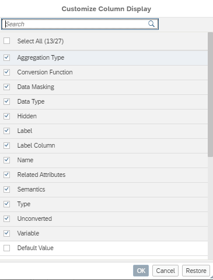

# Persist selection of to-be-displayed columns in node Semantics

The choice of to-be-displayed columns in node Semantics 

is now persisted within a developer workspace and thus reused across opening and closing calculation views and across sessions.

