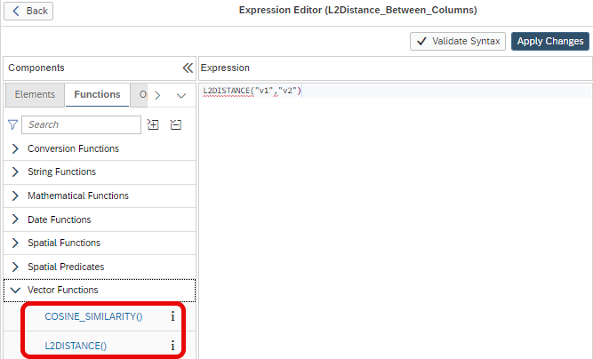

# Similarity functions for vectors

The two similarity functions [COSINE_SIMILARITY and L2DISTANCE](https://help.sap.com/docs/hana-cloud-database/sap-hana-cloud-sap-hana-database-modeling-guide-for-sap-business-application-studio/vector-functions) are now available in the expression editor:



# Example

Calculation view [sFVec_cv](./sFVec_cv.hdbcalculationview) is based on table [sFVe](./sFVec.hdbtable). Within the calculation view column "L2Distance_Between_Columns" calculates the L2DISTANCE between columns "v1" and "v2". Analogously, "CosSimilarity_Between_Columns" calculates the COSINE_SIMILARITY.


## Insert vector data into table

```SQL
INSERT INTO "sFVec" VALUES(to_real_vector('[1,2,3]'),to_real_vector('[0,2,3]'));
INSERT INTO "sFVec" VALUES(to_real_vector('[1,0,0]'),to_real_vector('[0,1,0]'));
INSERT INTO "sFVec" VALUES(to_real_vector('[1,1,1]'),to_real_vector('[0,1,1]'));
```

## Run SQL query

```SQL
SELECT TOP 1000
	"CC_1",
	SUM("L2Distance_Between_Columns"),
	SUM("CosSimilarity_Between_Columns")
FROM "sFVec_cv"
GROUP BY "CC_1"
```


