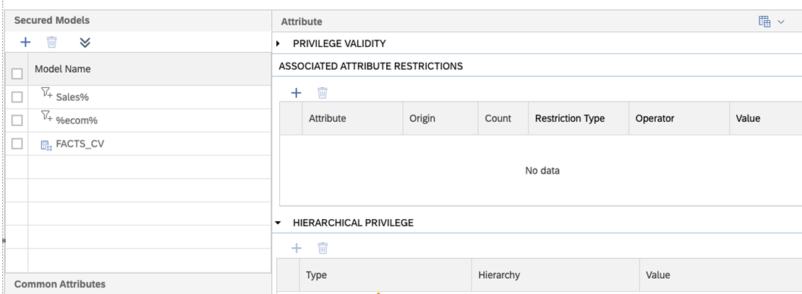

# Wildcard support in definition of analytic privileges

An analytic privilege (structured privilege or structured filter) can secure all calculation views that follow a certain name pattern by using SQL wildcards in the [definition of the analytic privilege](https://help.sap.com/docs/hana-cloud-database/sap-hana-cloud-sap-hana-database-modeling-guide-for-sap-business-application-studio/create-analytic-privileges):

Which calculation views are secured by the analytic privilege is determined at deployment time of the analytic privilege. Later deployments of e.g., a new calculation view in the same HDI container will trigger a redeployment of the analytic privilege so that the new calculation view is also included if the pattern matches.

> Deployment of the analytic privilege will fail, if the wildcard pattern matches to a view that is not defined to be secured by an analytic privilege

