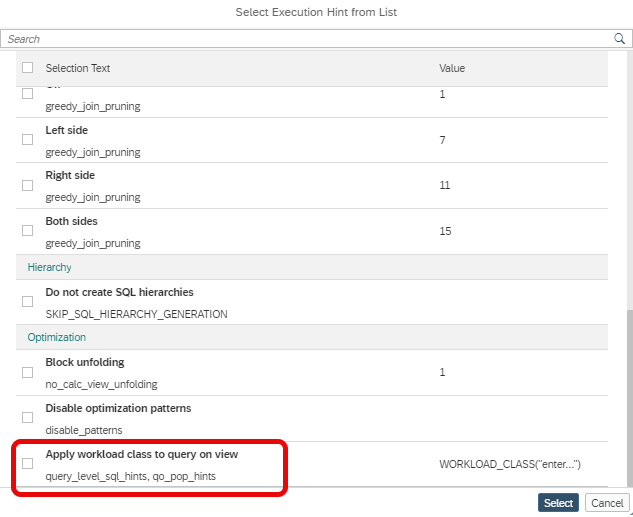

 # Support of Workload Class hint

 The dialog ["Select Execution Hint from List"](https://help.sap.com/docs/hana-cloud-database/sap-hana-cloud-sap-hana-database-modeling-guide-for-sap-business-application-studio/supported-calculation-view-hints) available under 
 
 *View Properties*, *Advanced* 
 
 supports adding a workload class hint:
 
 

 Based on this hint queries on the calculation view are executed with the respective [workload class](https://help.sap.com/docs/hana-cloud-database/sap-hana-cloud-sap-hana-database-administration-guide/managing-workload-with-workload-classes) setting. 
 
 ## Requirements

- The workload class to which the query on the calculation view is assigned needs to exist

- The Workload Class hint must be defined in the topmost calculation view to become effective during query execution
