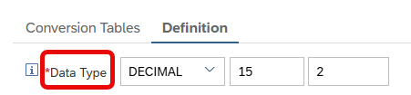
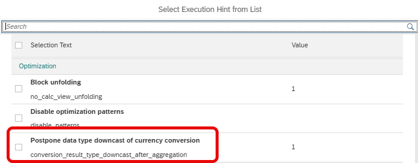

# [Cast currency-converted measures to target data type only after aggregation](https://help.sap.com/docs/hana-cloud-database/sap-hana-cloud-sap-hana-database-performance-guide-for-developers/optimizing-currency-conversion)

Per default, currency converted measures that have a different data type than *decfloat* are casted to their target data type before aggregating the currency converted measures. For measures of data type *decfloat* casting happens per default after aggregation.

Below you see the field that defines the target data type of currency conversion.

Currency conversion itself works with *decfloat* precision. If lower precisions than *decfloat* are required, casting needs to be done before currency conversion to reduce precision early. This is why casting for other data target types than *decfloat* per default happens before currency conversion.

Casting after aggregation and thus casting of fewer values can have positive effects on performance and resource usage. However, it also means that currency conversion is done with a higher precision than the specified target data type which can change the results slightly.

View hint *conversion_result_type_downcast_after_aggregation* can be used to enforce the data type casting after aggregation for other target data types than *decfloat*. 

For *decfloat* target data types the hint has no impact.

The hint will only become effective after a redeployment of the calculation view.

