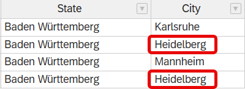
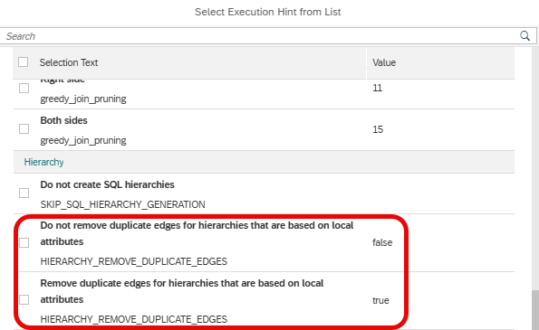

# [Hint HIERARCHY_REMOVE_DUPLICATE_EDGES ](https://help.sap.com/docs/hana-cloud-database/sap-hana-cloud-sap-hana-database-modeling-guide-for-sap-business-application-studio/supported-execution-hints)

Some hierarchy data sources contain multiple connections between two nodes like below where city *Heidelberg* is listed twice as child of state *Baden Wuerttemberg* 

If hierarchy data sources define multiple edges between nodes, in certain situations the value of such nodes like *Heidelberg* in the example above will be considered twice when aggregating values for e.g., *Baden Wuerttemberg*. In addition queries can fail because of the restriction that multiple parents are not allowed.

Several changes have been done in the past to meet customers' expections of how to deal with multiple edges. In an effort to consolidate the behavior the following default is used since QRC4 of 2024 with an option to modify the default behavior by a hint.

## Default behavior since QRC4 of 2024

a) Local hierarchies 

Multiple edges of local hierarchies are removed prior to hierarchy processing. No multiple accounting of a hierarchical connection or query failure happens

b) Shared hierarchies

Multiple edges of shared hierarchies are not removed. Multiple accounting of the same hierarchical connection and query failures can happen

## Overwrite default behavior by hint

View hint HIERARCHY_REMOVE_DUPLICATE_EDGES can be used to overwrite this default behavior.

If set to *true* also in case of shared hierarchies multiple edges are removed.

If set to *false* also in case of local hierarchies no removal of duplicate edges happens. 

For more details, see [SAP Note 3110332](.https://launchpad.support.sap.com/#/notes/3110332).

The hint will only become effective after redeployment of the calculation view.