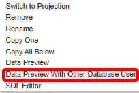

# [Option to Clean Up objects of previous intermediate data previews](https://help.sap.com/docs/hana-cloud-database/sap-hana-cloud-sap-hana-database-modeling-guide-for-sap-business-application-studio/clean-up-temporary-objects-from-intermediate-data-previews)

When running an intermediate data preview temporary objects are created to serve the data preview. These temporary objects are removed when the calculation view is redeployed on which the intermediate data preview had been run. 

These old intermediate objects can also be removed without redeployment by using the Clean Up option during the "Data Preview With Other Database User" dialog:

Choosing the Clean Up option will display the intermediate objects that exist in the selected schema and allows removing individual objects.

>Use this option to e.g. clean up remaining intermediate data preview objects after firefighting sessions in productive systems.

**NOTE** Intermediate data preview objects that had been created prior to the database upgrade cannot be deleted with the Clean Up option. To remove these objects, redeploy the respective calculation views.
