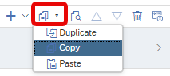
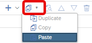

# [Copy Elements between views](https://help.sap.com/docs/hana-cloud-database/sap-hana-cloud-sap-hana-database-modeling-guide-for-sap-business-application-studio/duplicate-calculation-view-elements)

Elements such as calculated or restricted columns or input parameters and variables can be copied between views. It is possible to apply the Copy action on multiple selected elements. If referenced objects are not available in the target view those references are removed and the user is notified.

