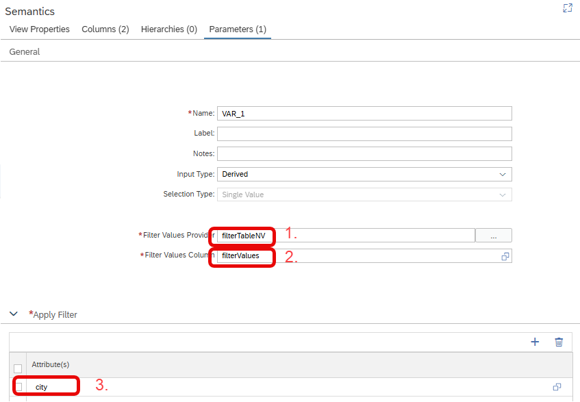

# [Variables of Input Type Derived](https://help.sap.com/docs/hana-cloud-database/sap-hana-cloud-sap-hana-database-modeling-guide-for-sap-business-application-studio/create-variables)

The new Input Type *Derived* of variables can be used to apply a large number of values as a filter. The filter values are based on a function/table or view that returns a tabular structure.


## Defining the variable

Specify...

a) a function, view or table that returns values in table format that should be used for filtering (1.)

b) which column contains the values that should be used in the filter (2.)

c) on which column filtering should happen (3.)




## Query execution
At query runtime the function/view/table is evaluated by clients who support this functionality and the returned values are added as a kind of IN-list filter on the filter column. Privilege SELECT or EXECUTE on the tabular data source is required for the executing user of the query.

## Example

In calculation view [filterBasedOnTable_cv](./filterBasedOnTable_cv.hdbcalculationview) variable *VAR_1* uses all values that are returned in column *filterValues* of table [*filterTableNV*](./filterTableNV.csv) as an IN-list filter. The filter values are applied on column *city*.
Clients that support this functionality will generate statements similiar to 

```SQL
SELECT 
	"city",
	SUM("amount") AS "amount"
FROM "filterBasedOnTable_cv"
    WHERE (( 
        "city" IN ( SELECT "filterValues" FROM "filterTableNV" ) -- generated based on variable definition
           )
        )
GROUP BY "city"
```

> Use this functionality if you want to filter based on column values of a tabular structure

