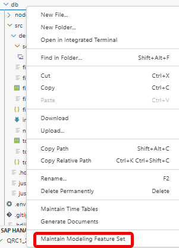

# [Choose target feature version](https://help.sap.com/docs/hana-cloud-database/sap-hana-cloud-sap-hana-database-modeling-guide-for-sap-business-application-studio/set-database-version-for-calculation-view-features)

To use only features in the modeler that are supported with a certain database release, the aimed database release can be specified in the context menu of the db module:

This makes it easier to develop for a specific target release in production independent of the database release in development. 

The first time this functionality is used the current database release is frozen. Subsequent invocations allow to select any database release version between the last frozen version and the current database release.

To avoid compatibility problems it is not possible to select a release version prior to the last frozen version.

The setting controls the availability of modeling features but has no influence on the database behavior. For example, database bugfixes will be included even though they might not be available in the database release of the productive system

> Use this feature to ensure that in development only modeling features are used that are also available in production.
