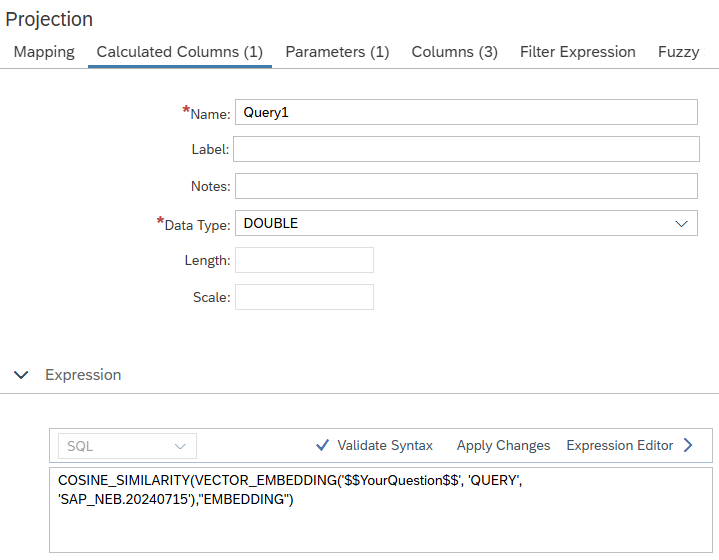

# [Vector Embeddings in Expressions](https://help.sap.com/docs/hana-cloud-database/sap-hana-cloud-sap-hana-database-modeling-guide-for-sap-business-application-studio/vector-functions)

The function *VECTOR_EMBEDDING* allows encoding of column values into a vector. Comparing this vector to other encoded vectors in a vector similarity space can be used to determine e.g., the similarity of a string to documents.
The functionality requires [enablement](https://help.sap.com/docs/hana-cloud/sap-hana-cloud-administration-guide/sap-hana-database-additional-features) of Natural Language Processing.


## Example
In calculation view [vE_cv](./vE_cv.hdbcalculationview) the string of input parameter *YourQuestion* is encoded into a vector and its similarity evaluated to documents in column *EMBEDDING* of table *vE*.



The vector embedding of column *EMBEDDING* is defined in table *vE* based on column *PARAGRAPH*:

```SQL
column table "vE"  (PARAGRAPH NVARCHAR(5000),EMBEDDING REAL_VECTOR **GENERATED ALWAYS AS VECTOR_EMBEDDING**(PARAGRAPH, 'DOCUMENT', 'SAP_NEB.20240715'))
```


Single quotes in the search string have to be escaped before passing the string to the input parameter. For example, the following query returns the similarity between the search string and the embedded vectors of column PARAGRAPH:

```SQL
SELECT
	"PARAGRAPH",
	MAX("Query1")
FROM "vE_cv"
	(placeholder."$$YourQuestion$$"=>ESCAPE_SINGLE_QUOTES('What''s the topic of Jan''s session?'))
GROUP BY
	"PARAGRAPH"
```

Alternatively, an input parameter derived by function like *escapedQuestion* of calculation view [vE_cv](./vE_cv.hdbcalculationview) can be used to escape the single quotes.

If input parameter *YourQuestion* in the calculated column *Query1* is replaced with the derived input parameter *escapedQuestion*, i.e.

```SQL
COSINE_SIMILARITY(VECTOR_EMBEDDING('$$escapedQuestion$$', 'QUERY', 'SAP_NEB.20240715'),"EMBEDDING")
```

no escaping at query level is required anymore:

```SQL
SELECT
	"PARAGRAPH",
	MAX("Query1")
FROM "vE_cv"
	(placeholder."$$YourQuestion$$"=>('What''s the topic of Jan''s session?')) -- no ESCAPE_SINGLE_QUOTES needed
GROUP BY
	"PARAGRAPH"
```

## Example Data
The following insert statements can be used to add example data into table *vE*:

```language
insert into "vE" values ('The What''s New presentation for calculation views is held by Jan Zwickel');
insert into "vE" values ('The What''s New presentation for machine learning  is held by Christoph Morgen');
insert into "vE" values ('the calculation view session is held on March 2025');
insert into "vE" values ('Jan likes to talk about calculation views');
```
> Use vector embeddings to leverage the high-performance HANA vector engine and obtain similarity metrics based on high-dimensional information