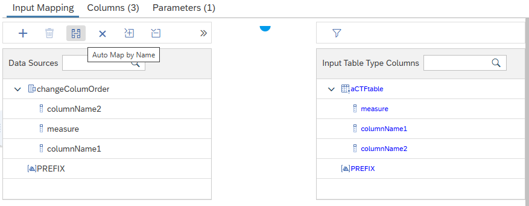
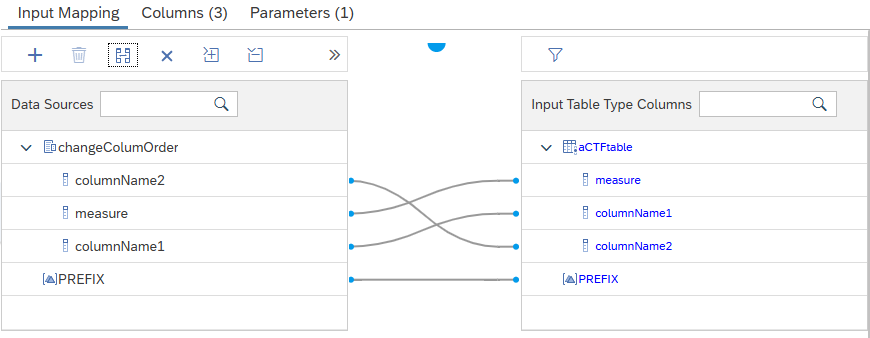

# Automap Columns By Name Inside Table Function Nodes

When mapping columns in table function nodes a new button is available that maps columns based on their names.

 Columns of the table input parameter of the table function that have the same names as the input columns, and scalar input parameters with the same names as calculation view input parameters will be automatically mapped when pressing the button.

