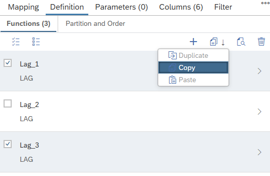
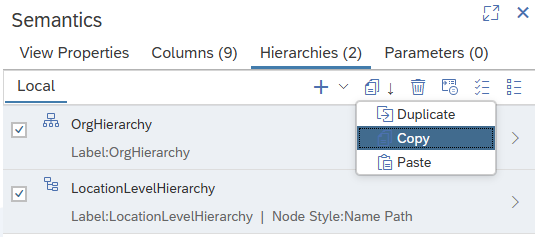

# Copy Elements Between Calculation Views

In addition to calculated and restricted columns as well as input parameters and variables also window functions and local hierarchies can now be copied between different calculation views.

If certain dependencies are not met in the target view a warning message will notify about them and the respective dependencies will be removed from the element definitions.

> Window functions can only be copied between window function nodes.

> Hierarchies can only be copied between hierarchy tabs. Shared hierarchies cannot be copied.