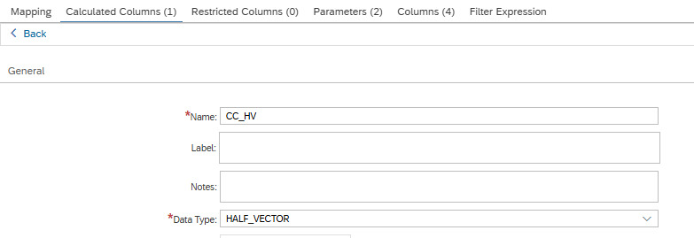
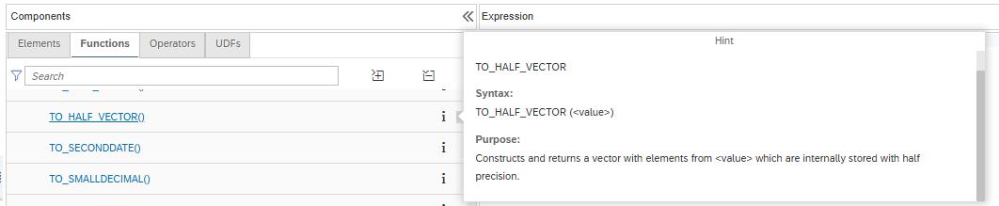

# HALF_VECTOR

The vector type HALF_VECTOR is now available for calculated columns. It uses 16 bits (16-bit Floating Point) to represent numeric values. Use this vector type to reduce memory footprint if the reduced precision compared to Real Vector (32-bit floating-point) can be tolerated.

Additionally, the SQL function [TO_HALF_VECTOR](https://help.sap.com/docs/hana-cloud-database/sap-hana-cloud-sap-hana-database-modeling-guide-for-sap-business-application-studio/conversion-functions) is now available for conversion

