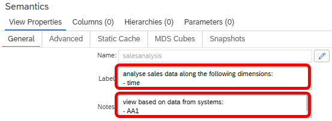
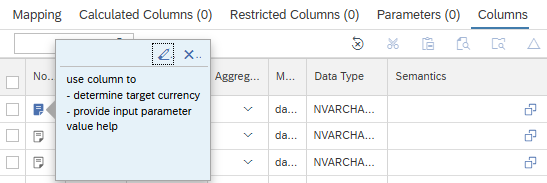

# [Labels and Notes with Line Breaks](https://help.sap.com/docs/hana-cloud-database/sap-hana-cloud-sap-hana-database-modeling-guide-for-sap-business-application-studio/add-comments-to-calculation-view-objects)

Notes and Labels of calculation views can now include line breaks.

Use line breaks to better structure your information

