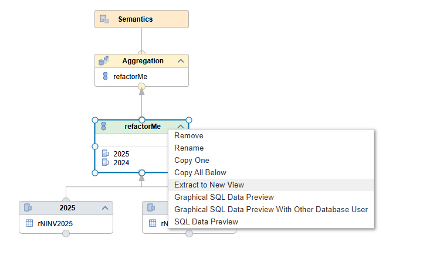
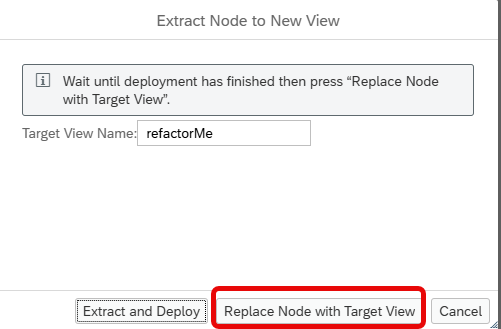
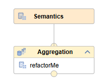
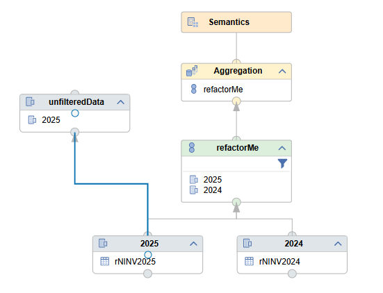

# [Refactor Node into new Calculation View](https://help.sap.com/docs/hana-cloud-database/sap-hana-cloud-sap-hana-database-modeling-guide-for-sap-business-application-studio/refactor-view-node-into-standalone-calculation-view)

You can now easily extract a node and its feeding structures into a new calculation view. 

Subsequently, the node can be replaced by the calculation view as a source:

## Restrictions
- Only view nodes can be refactored. The top-level Semantics node and its immediate child node cannot be refactored
- Extracting a view node into a new calculation view is not supported if any of its sub-nodes are reused in other parts of the calculation view's data flow, creating cross-dependencies. 

    In the example below node *unfilteredData* is using subnode *2025* of the feeding structures into node *refactorMe* and by this blocks the option to extract node *refactorMe* into a new calculation view. After deleting the flow into node *unfilteredData* extraction of node *refactorMe* becomes possible.

    

Use this option to better modularize and reuse calculation view logic.
