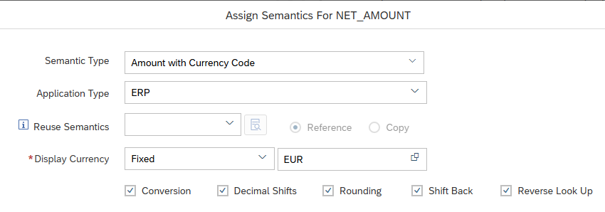

# Additional Currency Conversion Options for MDS Cube Measures with Conversion Time "Query Execution"

It is now possible to specify the options 

- Decimal Shifts
- Shift Back
- Rounding
- Reverse Look Up

also for measures that are included in MDS Cubes with Conversion Time setting "Query Execution":

With setting "Query Execution" conversions are performed during query execution and not MDS Cube loading time. Therefore, conversions can be steered by input parameter values on the fly.

> Use option to influence currency conversion with input parameter values on the fly

