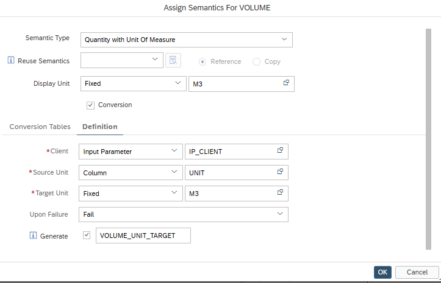
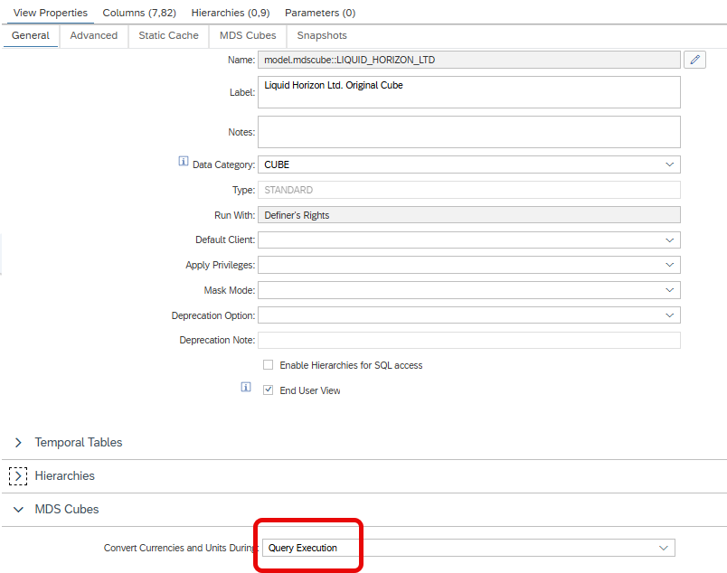

# Unit Conversion can now be Calculated at Query Execution Time

Execute unit conversions 

also with conversion setting "Query Execution"

> Use option to influence unit conversion with input parameter values on the fly
