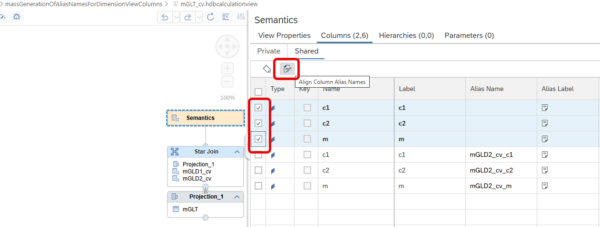
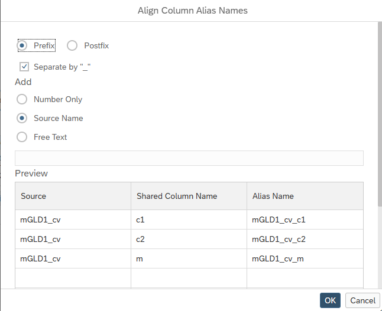

# [Align Alias Names](https://help.sap.com/docs/hana-cloud-database/sap-hana-cloud-sap-hana-database-modeling-guide-for-sap-business-application-studio/define-output-columns)

The Alias Names for columns of Dimension views in star-join nodes can now be generated using the dialog *Align Column Alias Names*:

For example, select the columns of Dimension View [mGLD1_cv](../massGenerationOfAliasLabelsForDimensionViewColumns/mGLD1_cv.hdbcalculationview) and press button *Align Column Alias Names* to also add a source prefix for these columns:

> Use this feature to align naming of already mapped dimension columns