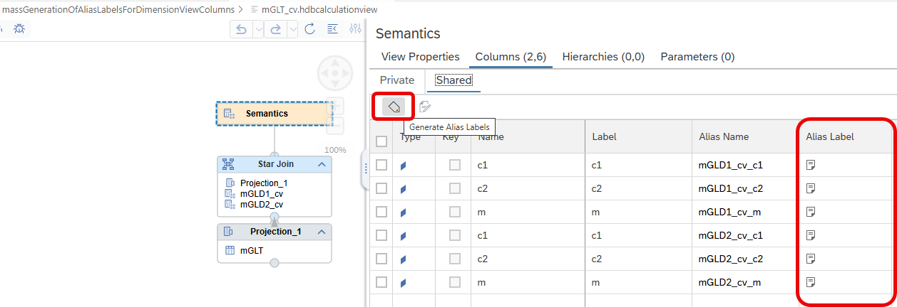
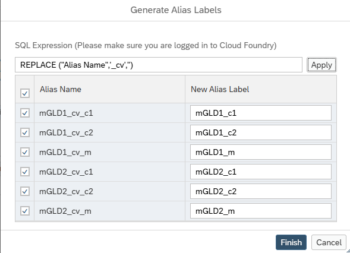

# [Mass Generation of Labels for Dimension View Columns](https://help.sap.com/docs/hana-cloud-database/sap-hana-cloud-sap-hana-database-modeling-guide-for-sap-business-application-studio/assign-labels-to-columns)

You can use expressions to generate Alias Labels for columns of Dimension Views that are used in Star Joins using button *Generate Alias Labels*:

For example, the following expression replaces "_cv" with an empty string in the Alias Name:

