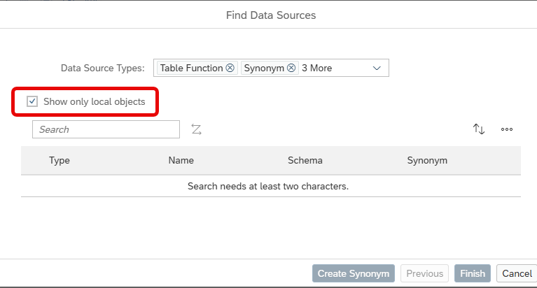

# [Restrict Search to Local Objects in Add Data Source Dialog](https://help.sap.com/docs/hana-cloud-database/sap-hana-cloud-sap-hana-database-modeling-guide-for-sap-business-application-studio/add-data-sources)

To only search for local objects set the flag *Show only local objects* in the Add Data Source dialog of calculation views:

The last choice in your developer workspace for *Show only local objects* is reused when opening the Add Data Source dialog next time.

> Use option to quickly find objects in your HDI container.