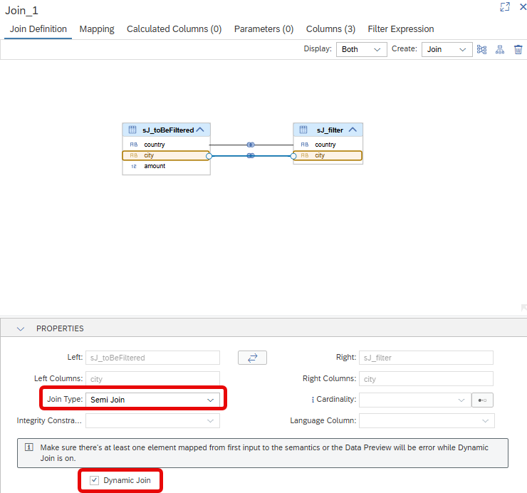

# [Semi Join](https://help.sap.com/docs/hana-cloud-database/sap-hana-cloud-sap-hana-database-modeling-guide-for-sap-business-application-studio/supported-join-types)

Semi Join is a Join Type that can be used for filtering based on tabular filter data. The implementation of Semi Joins is optimized for this kind of filtering. If you choose Semi Join as Join Type, values of the right join partner are used to filter the data of the left join partner. Only values that are available on the right side are retained on the left side. In addition to potential performance benefits compared to inner joins, there is also a semantic difference: duplicate filter values would lead to duplication of entries on the left side with inner joins while duplications of filter values are ignored with semi joins.

Due to the filter logic, only columns from the left side can be mapped to the output of the node. 

## Dynamic Join
Semi joins can be combined with the "Dynamic Join" option. With option "Dynamic Join", other join types than Semi Joins return an error if non of the join columns are requested by the query. In contrast, for Semi Joins, if no join columns are requested, no filtering takes place and all values of the left join partner are returned.

## Examples

### Dynamic join on two columns

The to-be-filtered data are provided by [sJ_to_BeFiltered.csv](./sJ_toBeFiltered.csv) 

#### to be filtered data

**country**|**city**|**amount**
:-----:|:-----:|:-----:
Germany|Heidelberg|10
Germany|Berlin|10
Germany|Walldorf|10
Germany|Heidelberg|10
Germany|Hamburg|10
Sweden|Stockholm|10
Sweden|Gothenburg|10
Sweden||10
Norway|Oslo|10

and used as left join partner. 

The join is defined on columns *country* and *city* and the Dynamic Join option is used in [sJ_cv](./sJ_cv.hdbcalculationview):



[sJ_filter.csv](./sJ_filter.csv) provides the filter values, i.e. the data of the right join partner:

#### filter list ###

**country**|**city**
:-----:|:-----:
Germany|Walldorf
Germany|Wiesloch
Germany|Berlin
Germany|Heidelberg
Sweden| 

If both join columns *country* and *city* are requested in the query

#### query

```SQL
SELECT 
	"country",
	"city",
	SUM("amount") AS "amount"
FROM "sJ_cv"
GROUP BY "country", "city"
```

both columns of the join partners must match to include a record. Because "Hamburg" is not in the filter list and no cities of Sweden, applying the filter results in the following data:

#### result of applying filter

**country**|**city**|**amount**
:-----:|:-----:|:-----:
Germany|Heidelberg|10
Germany|Berlin|10
Germany|Walldorf|10
Germany|Heidelberg|10
Germany|~~Hamburg~~|10
Sweden|~~Stockholm~~|10
Sweden|~~Gothenburg~~|10
Sweden|~~NULL~~ |10
~~Norway~~|~~Oslo~~|10

Here the values that lead to removal are crossed out.

#### result of query

**country**|**city**|**amount**
:-----:|:-----:|:-----:
Germany|Heidelberg|20.00
Germany|Berlin|10.00
Germany|Walldorf|10.00

With setting Dynamic Join, if only "country" is requested then only "country" has to match on both sides.

```SQL
SELECT 
	"country",
	SUM("amount") AS "amount"
FROM "sJ_cv"
GROUP BY "country"
```

Therefore applying the filter keeps all countries that are included in the filter data

#### result of applying filter

**country**|**city**|**amount**
:-----:|:-----:|:-----:
Germany|Heidelberg|10
Germany|Berlin|10
Germany|Walldorf|10
Germany|Heidelberg|10
Germany|Hamburg|10
Sweden|Stockholm|10
Sweden|Gothenburg|10
Sweden| |10

and the query returns:

#### result of query

**country**|**amount**
:-----:|:-----:
Germany|50.00
Sweden|30.00

Therefore, even though no city is maintained for Sweden if the query only asks for country information Sweden is kept.
If no join column is requested no filtering takes place and all values of the left side are returned:


```SQL
SELECT 
	SUM("amount") AS "amount"
FROM "sJ_cv"
```

#### result of applying filter

**country**|**city**|**amount**
:-----:|:-----:|:-----:
Germany|Heidelberg|10
Germany|Berlin|10
Germany|Walldorf|10
Germany|Heidelberg|10
Germany|Hamburg|10
Sweden|Stockholm|10
Sweden|Gothenburg|10
Sweden| |10
Norway|Oslo|10

and the query returns:

90

> Use semi joins if you want to filter data based on tabular values to optimize performance and to ignore filter value duplicates.