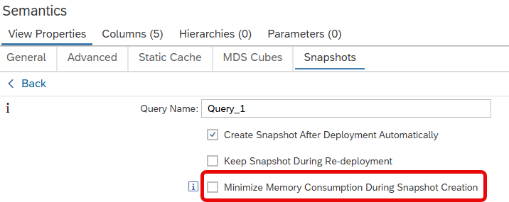

# Prefer Reduced Memory Consumption over Speed When Creating Snapshots

When setting flag "Minimize Memory Consumption" for a snapshot query, 

filling the snapshot will be done with the [spill to disk hint](https://help.sap.com/docs/hana-cloud-database/sap-hana-cloud-sap-hana-database-administration-guide/memory-management-with-spill-to-disk).

This trades a minimized memory consumption against a potentially longer runtime.

> Use option to reduce memory consumption if performance of filling the snapshot is not critically