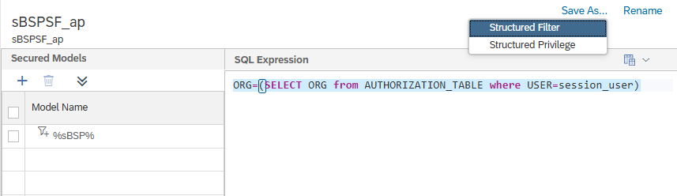
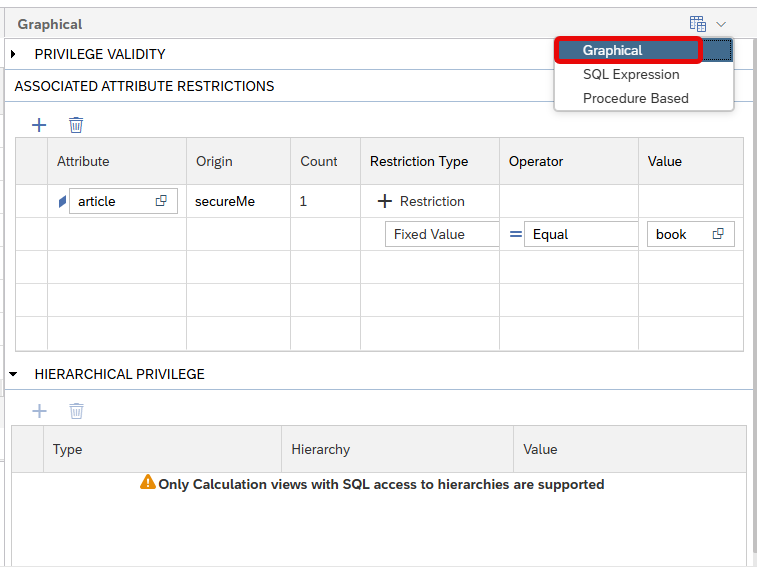

# [Switch between Different Types of Analytic Privileges](https://help.sap.com/docs/hana-cloud-database/sap-hana-cloud-sap-hana-database-modeling-guide-for-sap-business-application-studio/convert-between-analytic-and-structured-privileges)

When opening an analytic privilege in the graphical editor the *Save As...* option allows to store the privilege in a different format, e.g., as a structured filter or privilege:

This way it becomes easier to change between the different types of analytic privileges.

> Only information of SQL Expression and Procedure Based information are retained. Graphical specifications are lost.

Two privileges with the same name cannot exist in the database. Therefore, make sure to rename / delete one of the privileges before deploying the folder containing both privileges. 

The Apply Privileges type of a calculation view must correspond to the privilege type of the analytic privilege that uses the calculation view as secured model. Therefore, make sure to also switch the privilege check of the calculation view before deploying all objects together.

> If wildcards are used in the analytic privilege to specify the secured models then the type of Apply Privileges of the calculation view is not required to match for successful deployment of the analytic privilege. Importantly, privileges not matching in type to the calculation view Apply Privilege check will not be applied.