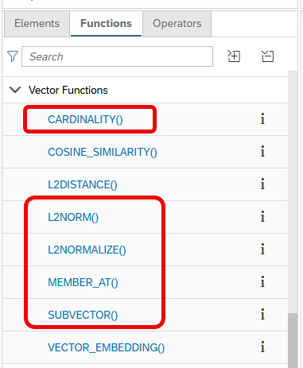

# Additional Vector Engine Functions

The additional vector engine functions

- CARDINALITY
- L2NORM
- L2NORMALIZE
- MEMBER_AT
- SUB_VECTOR

 are now supported in expressions:

 

See [documentation](https://help.sap.com/docs/hana-cloud-database/sap-hana-cloud-sap-hana-database-vector-engine-guide/vector-function-reference) for details on their usage.

To insert some data into the table on which [vEF_cv.hdbcalculationview](./vEF_cv.hdbcalculationview) is based, run e.g.,:

```SQL
insert into "vEF" values ('Today is the calculation view session')
```

