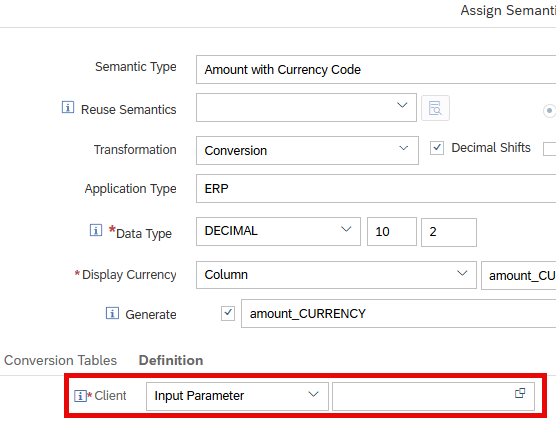
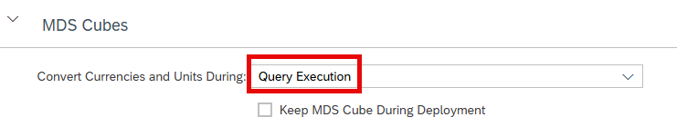

# Use Input Parameters to fill Client Values for Currency Conversion

MDS Cubes now support also input parameters as sources for client values in currency conversion.

Like with input parameters for other conversion settings the input parameter values do not require materialization when used with option Query Execution:

> Input parameters combined with the Query Execution mode gives you the full flexibility to choose the client value during reporting also with MDS Cubes. 