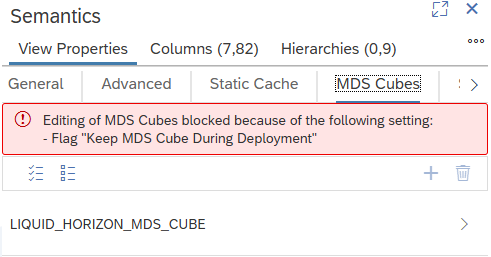

# Keep MDS Cube During Deployment

During successful redeployments, per default, MDS Cubes are dropped and recreated. This means that data that have been loaded into MDS Cubes will be deleted. This can be particularly unwanted if the redeployment is a consequence of an underlying redeployed calculation view. 

## Purpose of Keep MDS Cube During Deployment
Set the *Keep MDS Cube During Deployment* flag if you want to keep the MDS Cube and thus the data also during redeployment:

Setting the *Keep MDS Cube During Deployment* flag ensures that reporting on and loading of the MDS Cube can continue as before the redeployment.

## Development Impact when setting MDS Cube During Deployment

Setting the flag will have the following impact on development activities:

### Calculation View Editor
If the *Keep MDS Cube During Deployment* flag is set no changes to the MDS Cube are allowed and editing of the MDS Cube is blocked:

Unset the flag if you want to edit the MDS Cube. Future redeployments will delete the data. If you set the flag again without prior deployment of your modifications, the deployed MDS Cube will remain and not reflect your changes. This means that the MDS Cube model that you see in the editor can differ from the deployed model.

### Calculation View Deployment

Starting a deployment of the calculation view is still possible but will not change the MDS Cube. The deployment will fail if it would lead to an MDS Cube that cannot be loaded anymore, e.g., a column used in the MDS Cube is removed from the calculation view.
While the MDS Cube itself will not be modified by a successful deployment of the calculation view, changed meta data of the calculation view such as changed hierarchies will be reflected when using the MDS Cube in e.g., SAC. 

> Use this flag to keep MDS Cube data also across redeployments

