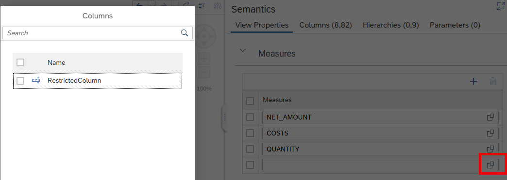

# Support of Restricted Columns in MDS Cubes

Restricted columns can now be added to MDS Cubes. 

If a restricted column is added to an MDS Cube the respective base measure and potentially other columns that are used in the expression need to be added to the MDS Cube as well.

Not all expressions are currently supported. You will be notified during deployment if a restricted column cannot be supported so that you can remove the restricted column from the MDS Cube. 

> Calculate measures on data that is filtered based on an expression by using restricted columns