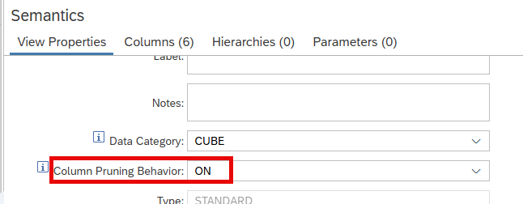

# Option to Choose Column Pruning Behavior

The [instantiation logic](https://help.sap.com/docs/hana-cloud-database/sap-hana-cloud-sap-hana-database-modeling-guide-for-sap-business-application-studio/9ed48614318a4831a8a6b3e3222a05f0.html) of calculation views reduces the number of processed columns and data sources based on the query. If instead a relational behavior similar to SQL views is intended all columns can be tagged with the property "[Keep Flag](https://help.sap.com/docs/HANA_CLOUD_DATABASE/d625b46ef0b445abb2c2fd9ba008c265/f0e101a7641340708f0b098206210d9c.html)". To simplify this, the option "[Column Pruning Behavior](https://help.sap.com/docs/hana-cloud-database/sap-hana-cloud-sap-hana-database-modeling-guide-for-sap-business-application-studio/control-column-pruning-in-calculation-view)" can be set to "OFF" which automatically sets the Keep Flag property for all columns:

Forcing additional columns into the aggregations can change the results, lead to higher resource consumption and a decrease in performance. Therefore, Column Pruning Behavior should only be set to "OFF" if SQL view behavior is required.

> Use this option to quickly compare the results with and without instantiation logic or if you want to mimic SQL behavior.

