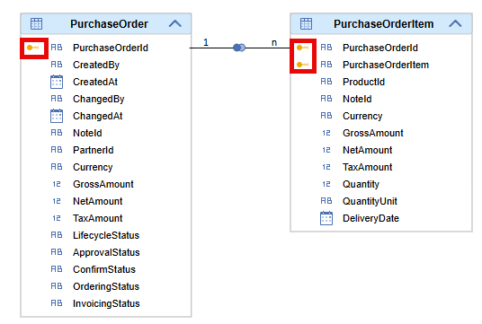

# Indicators of Key Columns

To support the decision on which columns a join should be defined the key column indicator highlights columns that belong to the key of a data source:

Information about key columns is only shown in [join nodes](https://help.sap.com/docs/hana-cloud-database/sap-hana-cloud-sap-hana-database-modeling-guide-for-sap-business-application-studio/create-joins) and derived from underlying data sources. For table data sources the information is taken from the primary key information of the table. For calculation view data sources the key information is taken from the Semantics node. Currently, if columns that are part of the primary key are not mapped to a join node the remaining columns of the primary key are still highlighted with the key icon. 

The key information is propagated within a model but not into the Semantics node, so that the decision about the Semantics node key can be done explicitly.

> Use the key information to decide about join columns and join cardinality
