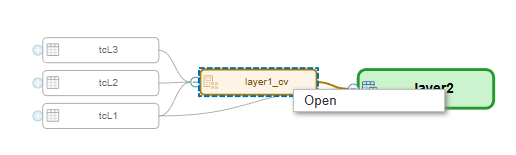
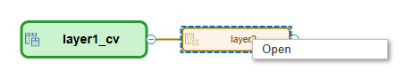
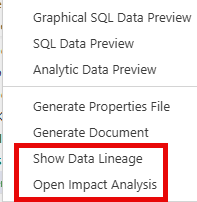

# Open objects in Data Lineage and Impact Analysis Display

When analyzing the consumed objects of a calculation view ([data lineage](https://help.sap.com/docs/hana-cloud-database/sap-hana-cloud-sap-hana-database-modeling-guide-for-sap-business-application-studio/13538ddb57924150b3ca62a53749dc99.html)) or the consumers of a calculation view ([impact analysis](https://help.sap.com/docs/hana-cloud-database/sap-hana-cloud-sap-hana-database-modeling-guide-for-sap-business-application-studio/df9ca3197a6544ff90c7b37eb4280404.html)) the displayed objects within the same HDI container can now be opened in their associated editors.

### Data Lineage

### Impact Analysis

Data Lineage and Impact Analysis are available via the context menu of calculation view files:

> Use this option to better understand the objects that are involved in lineage and impact analysis

