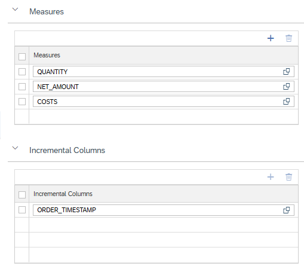

# [Incremental Loading of MDS Cubes](https://help.sap.com/docs/hana-cloud-database/sap-hana-cloud-sap-hana-database-administration-guide/api-for-managing-mds-cubes#command-update)

When MDS Cubes are loaded incrementally only records that have been added since the last update are loaded. This reduces the resource consumption and required time when loading MDS Cubes.

## Select Incremental Columns

To allow for incremental loading a MDS Cube attribute needs to be defined as Incremental Column:

The content of the selected column needs to increase with each record that is added to the result set of the calculation view. 

During incremental updating only records are loaded that have a higher value in the Incremental Column than the highest value at the last time of loading. 

Use the [Update](https://help.sap.com/docs/hana-cloud-database/sap-hana-cloud-sap-hana-database-administration-guide/api-for-managing-mds-cubes#command-update) command to start incremental loading. 

> Use incremental update when loading MDS Cubes to speed up loading and to reduce CPU and memory consumption