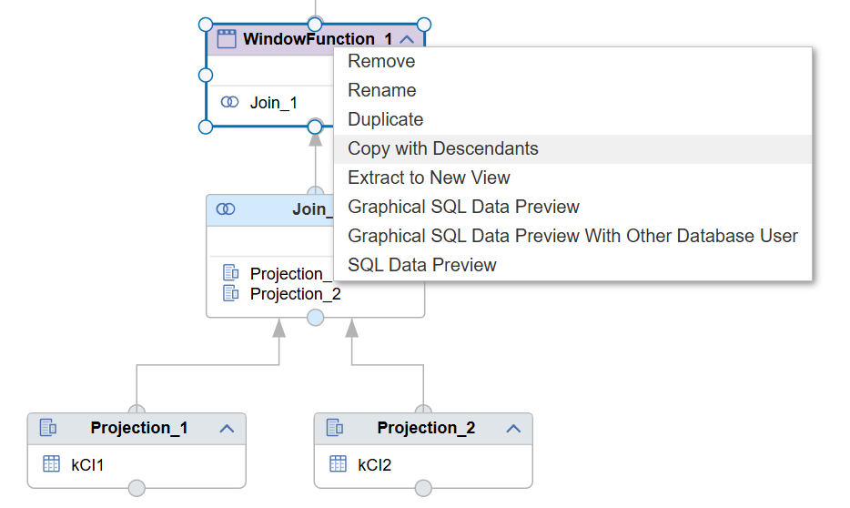
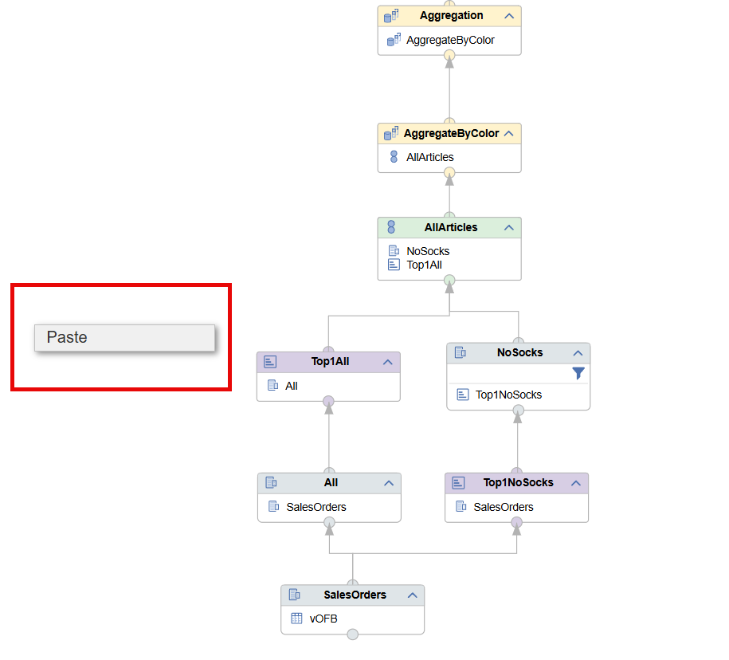
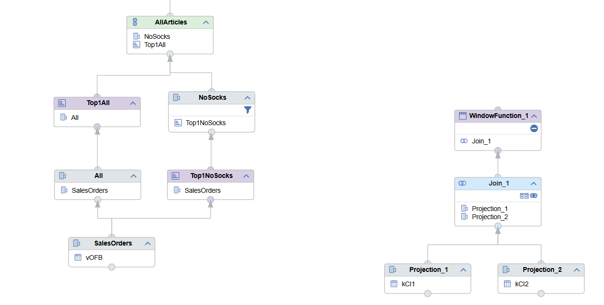

# [Copy Nodes with Descendants](https://help.sap.com/docs/hana-cloud-database/sap-hana-cloud-sap-hana-database-modeling-guide-for-sap-business-application-studio/duplicate-copy-or-remove-nodes)

With the option to Copy nodes with their feeding structures it becomes easier to re-use logic in multiple calculation views. To use this functionality:

1. Select *Copy with Descendants* in the context menu of the node that you want to copy with its feeding structures:

    

2. In the target view right-click at an empty space and select "Paste":

    

The copied nodes are added to the target calculation view:

Potential naming conflicts if nodes with the same name already exist are resolved by adding the suffix "copy" to the node names. Inconsistencies can arise if required objects are not available in the target calculation view. These inconsistencies have to be solved manually.

> Leverage *Copy with Descendants* to reuse calculation view logic across calculation views