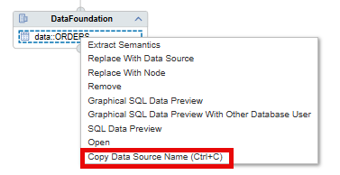

# [Copy Texts of Elements](https://help.sap.com/docs/hana-cloud-database/sap-hana-cloud-sap-hana-database-modeling-guide-for-sap-business-application-studio/copy-data-source-names)

Element texts such as the data source name or calculation view name can now easily copied either with a right-click or a keyboard short-cut:

> Use this option to avoid typos and manual effort when e.g., trying to add a specific data source