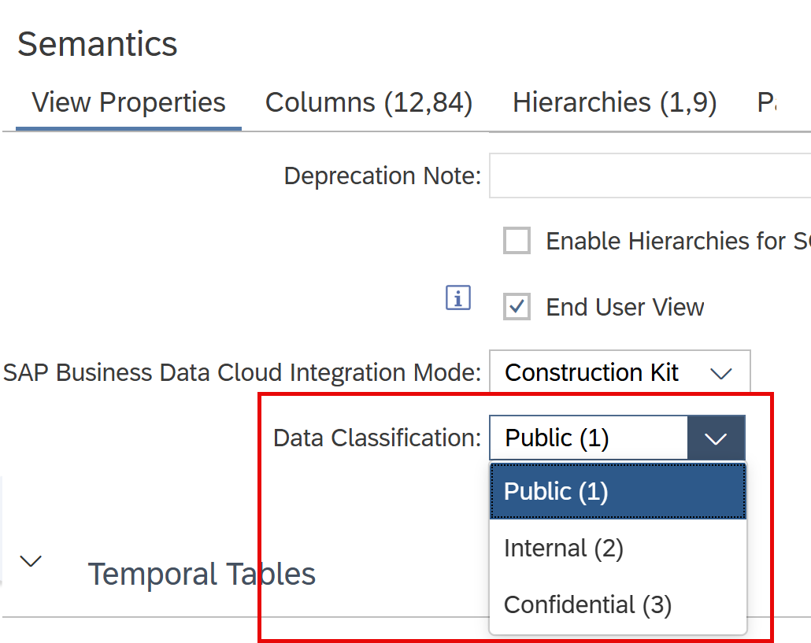

# [Data Classification](https://help.sap.com/docs/hana-cloud-database/sap-hana-cloud-sap-hana-database-modeling-guide-for-sap-business-application-studio/data-classification-for-calculation-views)

Different data classifications can be assigned to calculation views to indicate how data that are returned by a calculation view should be treated.

## Setting Data Classification of Calculation View

Define the classification of the data of a calculation view under View Properties:




### Define which Data Classifications are Available
You can change the displayed ratings by changing the values of table BIMC_SENSITIVITY_CLASSIFICATION in schema _SYS_BI. This table per default can only be changed by database user DBADMIN.

For example, if you want to make the ratings *Public*, *Internal*, *Confidential* available you can run the following statements with database user DBADMIN:

```SQL
INSERT INTO _SYS_BI.BIMC_SENSITIVITY_CLASSIFICATION VALUES (1, 'Public');
INSERT INTO _SYS_BI.BIMC_SENSITIVITY_CLASSIFICATION VALUES (2, 'Internal');
INSERT INTO _SYS_BI.BIMC_SENSITIVITY_CLASSIFICATION VALUES (3, 'Confidential');
```
> If BIMC_SENSITIVITY_CLASSIFICATION is not filled the Data Classification option is not shown. 

## Reading Data Classification Rating of Calculation view

The data classification rating of a calculation view can be read from column SENSITIVITY_CLASSIFICATION of view _SYS_BI.BIMC_ALL_AUTHORIZED_CUBES, e.g.

```SQL
SELECT 
    SCHEMA_NAME, 
    QUALIFIED_NAME, 
    SENSITIVITY_CLASSIFICATION 
FROM 
    _SYS_BI.BIMC_ALL_AUTHORIZED_CUBES
```

## Consistency Checks

When a calculation view is opened or a Data Source added a warning is shown if the current calculation view has a lower rating than any of the directly consumed calculation views. 
In this case it is offered to adapt the current calculation view rating to the highest rating of the consumed calculation views.

> Use data classifications to support the consistent handling of classified data throughout your company