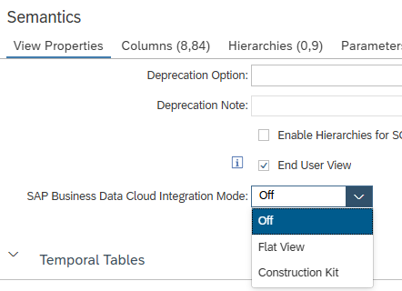
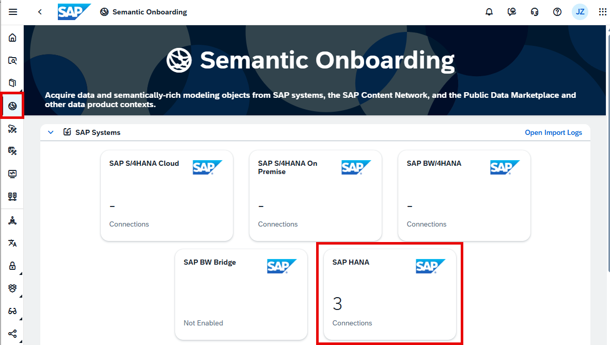
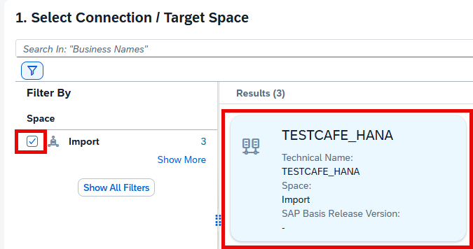
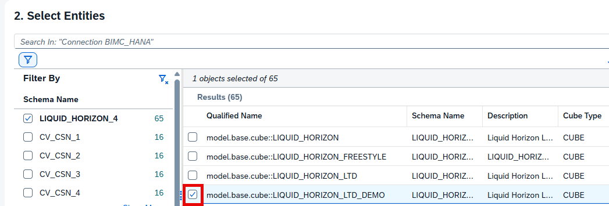
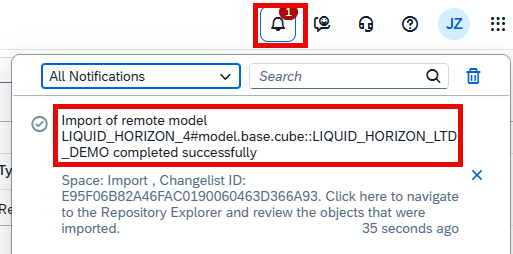
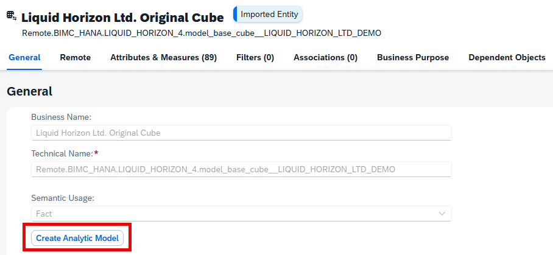
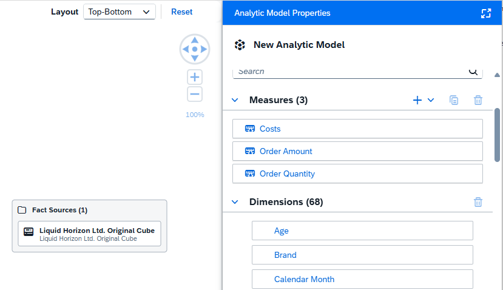

# [Reuse of Existing Calculation Views in SAP Business Data Cloud (BDC)](https://help.sap.com/docs/hana-cloud-database/sap-hana-cloud-sap-hana-database-modeling-guide-for-sap-business-application-studio/enable-business-data-cloud-integration-mode-for-calculation-view)

To reuse existing calculation views in the context of BDC, calculation views can be semantically onboarded. This offers the opportunity to leverage calculation views in SAP HANA Cloud standalone and at the same time to also use and extend the calculation views in BDC. This way the best of both solutions can be used.

Semantic onboarding transfers the semantics of the calculation view but not the data into BDC. It creates BDC proxies that subsequently can be used in BDC modeling.

## Semantic Onboarding

The semantic onboarding process starts in Business Application Studio by selecting a BDC Integration mode.

### Integration Mode

- "Flat View" onboards calculation views as a flat structure that includes the private and shared attributes of the calculation views. This integration mode is not available for Dimension Views
    > Use this option if you do not plan larger enhancements in BDC.
    
- "Construction Kit" imports only the private attributes of cubes. Also Dimension Views can be imported in this mode. This allows to recombine or change the structure of the original calculation views in BDC
    > Use the Construction Kit approach if you require flexibility in recombining calculation views in BDC

All integration modes create BDC proxies for the calculation views. Queries targeted to these proxies will be directed to the source calculation views.

### BDC Onboarding Process (requires upgraded version of SAP Datasphere. Below are lab-preview screenshots of what is planned to become available end of April 2026)

In BDC go to option *Semantic Onboarding* and choose connection type *SAP HANA*

Select your HANA connection and the target space:

Search for the calculation view(s) that you would like to onboard and select them:

After importing and deploying open the model:

You have now the option to create an Analytic Model that is based on the calculation view and its semantics:

The created Analytic Model can now be used like other Analytic Models:

## Onboarded Semantic

The following semantic information of calculation views is reused by the Analytic Model:

- Input Parameters
- Variables
- Currency and unit conversion information
- Labels
- Shared hierarchies
- Information about Dimensions of star-joins

> Use semantic onboarding to leverage existing calculation views in the context of SAP Business Data Cloud