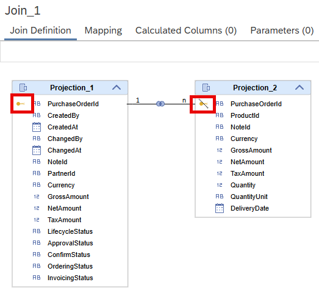
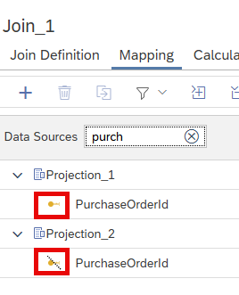
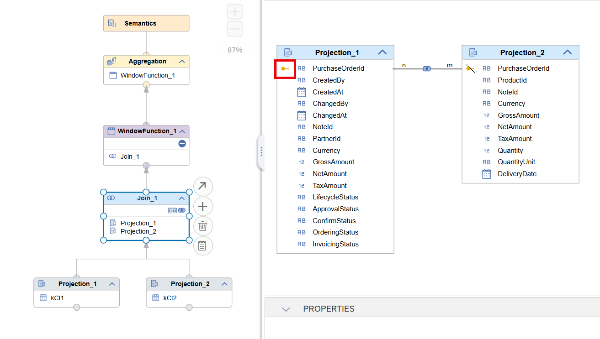
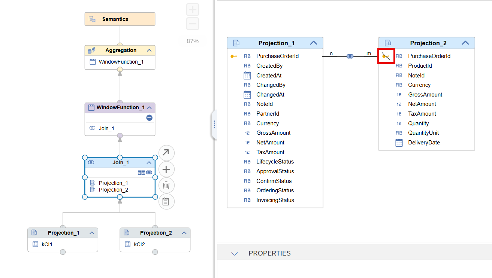
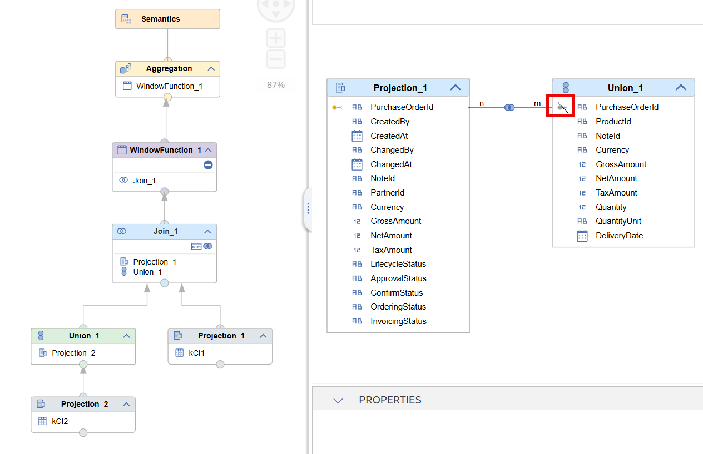

# Key Column Indicator

To support the decision on which columns a join should be defined the key column indicator highlights columns that belong to the key of a data source. The icons appear in the mapping and join definition displays.

The information of the key indicator is based on the primary key definition in case of table data sources and on the Semantics key in case of calculation views as data sources.

A key indicator can appear in gold or grey and can be solid or dashed.

 

A golden icon visualizes a complete key

A dashed icon indicates that the key is not complete anymore. This can happen if only some columns of a multiple column key are projected 

Grey indicates that some intermediate operations might have removed the key property. For example a Join, Union, or Table Function node inbetween removes the key property 

The key column indicator are shown in the join details and the incoming side of tab Mapping:

     

## Example complete key

*PurchaseOrderId* is the complete key of the [data source](kCI1.hdbtable) on the left. The golden icon visualizes this:

## Example partial key

For the [data source](kCI2.hdbtable) on the right side *PurchaseOrderItem* is also part of the key but not mapped. Therefore the key on the right side is not complete and *PurchaseOrderId* is dashed:

## Example intermediate node that leads to an unclear key status

If a Union node is placed before the Join node the status of the key is unclear and the key icon is shown in grey. In addition, because *PurchaseOrderItem* is also missing, *PurchaseOrderId* is shown dashed:

> Use information about key columns e.g., when deciding on join columns