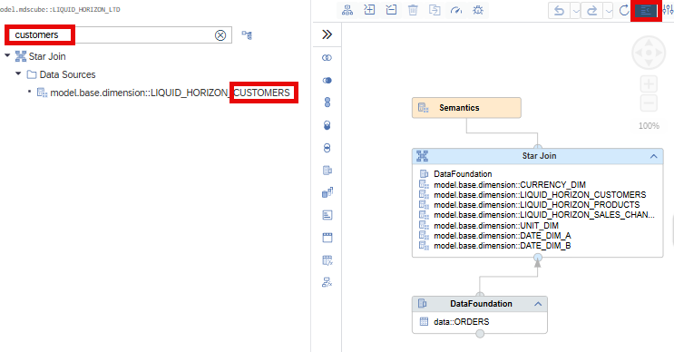

# [Show Data Sources in Outline](https://help.sap.com/docs/hana-cloud-database/sap-hana-cloud-sap-hana-database-modeling-guide-for-sap-business-application-studio/create-calculation-views)

Data sources are now included in the Outline:

 This completes the picture about relevant structures of the calculation view.

> Use the Outline to get an overview of which data sources are used in a calculation view and in which nodes