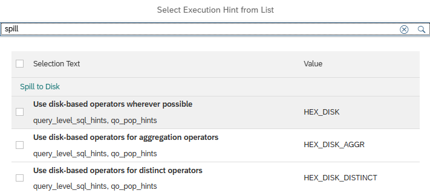

# [Spill To Disk Hints in Execution Hints List](https://help.sap.com/docs/hana-cloud-database/sap-hana-cloud-sap-hana-database-modeling-guide-for-sap-business-application-studio/add-execution-hints)

[Spill To Disk hints](https://help.sap.com/docs/hana-cloud-database/sap-hana-cloud-sap-hana-database-administration-guide/use-hints-to-enable-spill-to-disk) can be used to trade a lower memory consumption against slower query executions.

The hints are now also available in the [pre-defined hint list](https://help.sap.com/docs/hana-cloud-database/sap-hana-cloud-sap-hana-database-modeling-guide-for-sap-business-application-studio/9fd70ce83ee546e7bde7ec3c2333488a.html):

> Decrease memory consumption for queries that are not performance critical using the *Spill To Disk Hints*